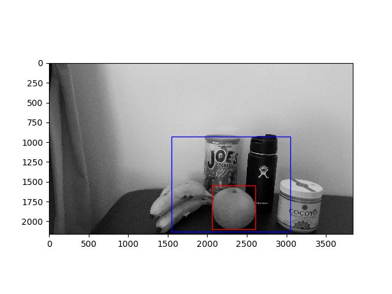
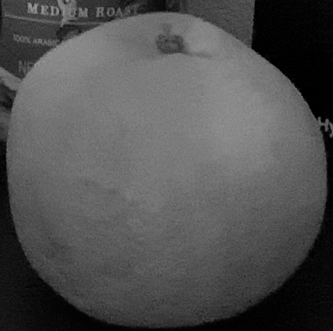
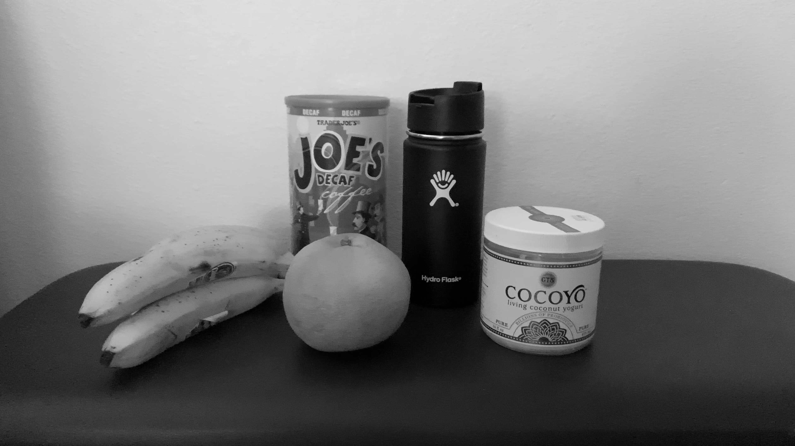
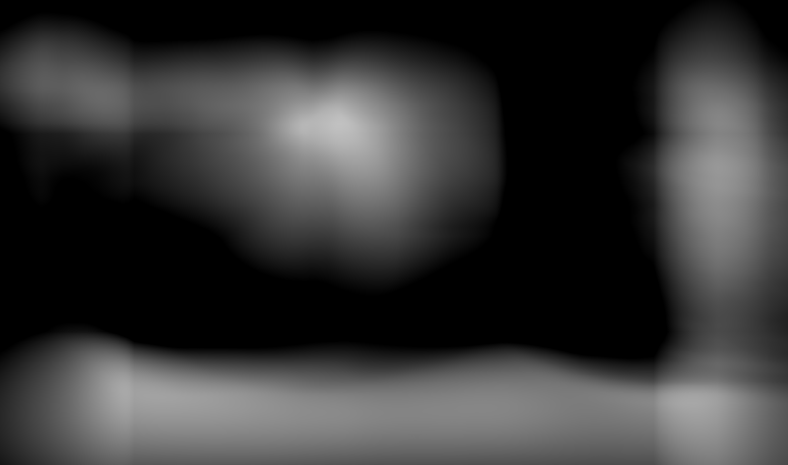
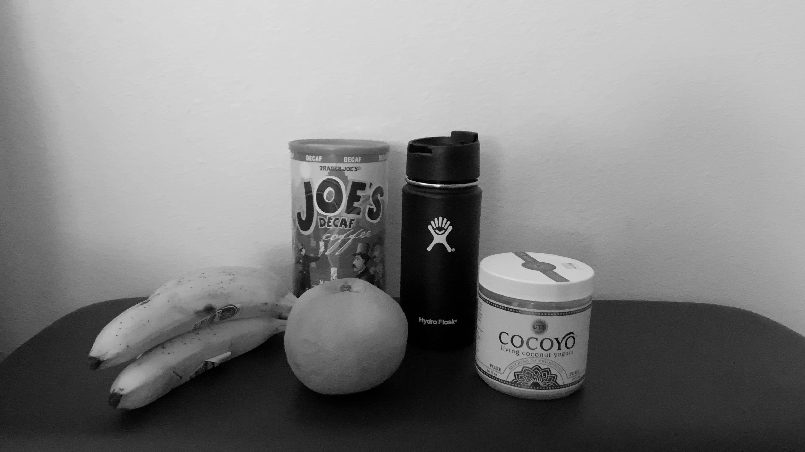
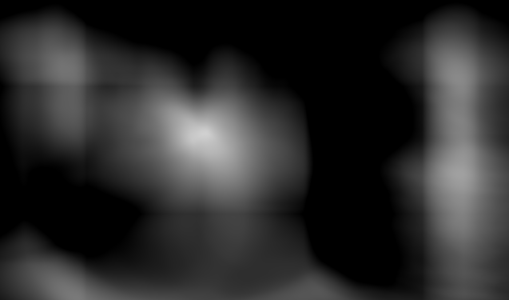
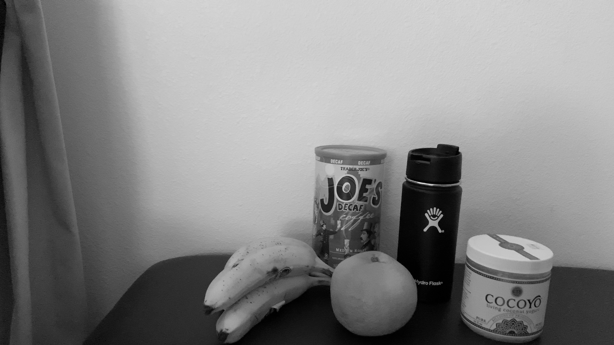
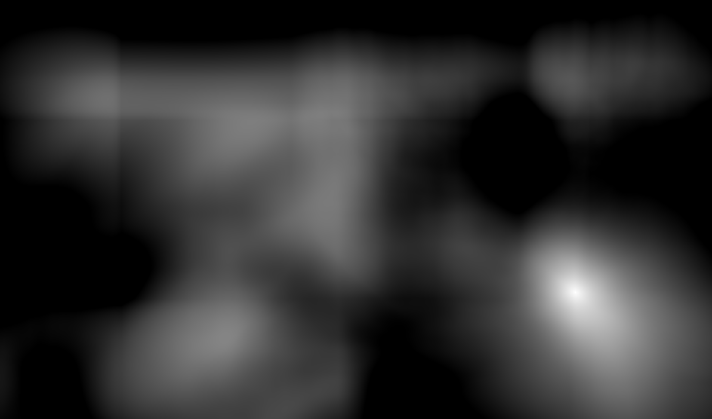
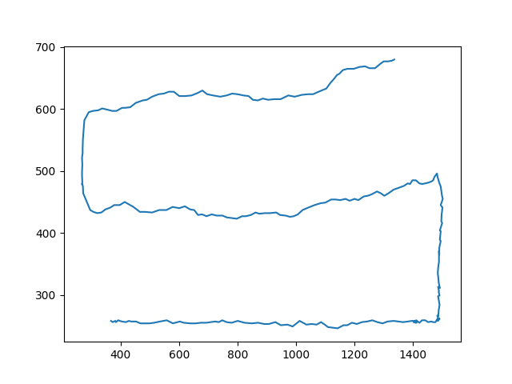
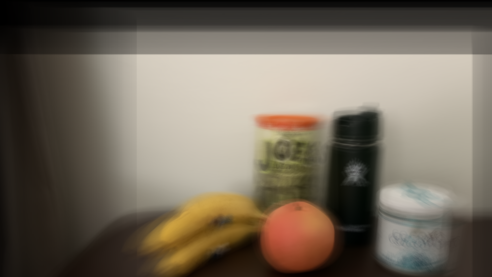

The goal of this project is setting a template in the picture(captured from video) with grayscale.
And blur the background except template; figuring out how to be filmed the template.

First, mannually setting the window and template. The window(blue) is represeting the range
of the template's location changes in all frames (captured from the whole video)
and the template(red) is the target object.

The orange is the template.

The left side is the image in some period of frames and the right side is the new
representation of image with match_template(). When getting the images from match_template,
it was not necessary to use the whole image so that the window of the image is used.
The highest value (brightest) point is the location of template. and by saving each of 
points in each picture would allow us the location change of template.

 
 
 

Comparing each point to the first start point, visualizing the location change of template.

Based on the information, shifting the each of images and combining them.

Except the template(orange), background has been blurred and the image(shape?) of the template is clear than others.
